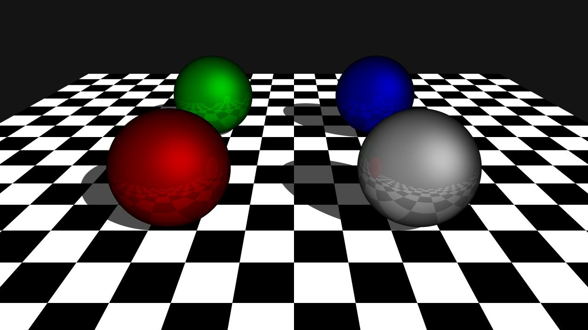
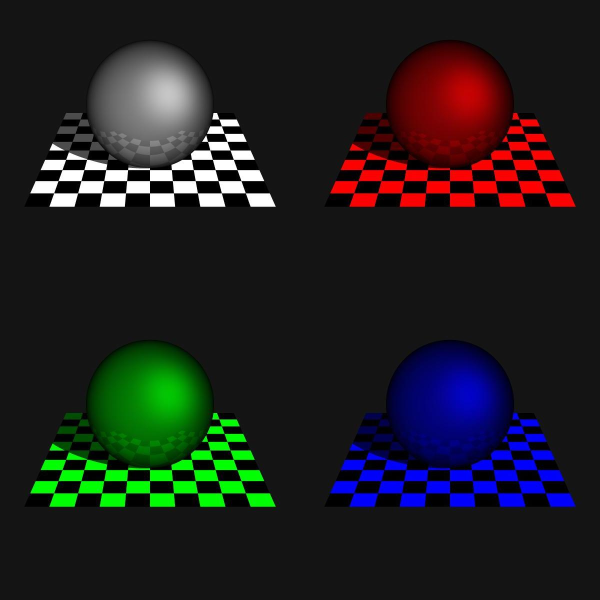

# GoTracing Project

This is a ray tracing project which is based on golang.

The purpoes of the project is just for me to learn golang.

## Example

* some objects in one scene

* object in different light color
